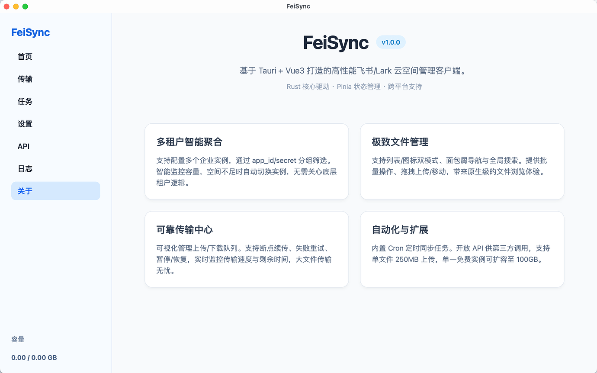
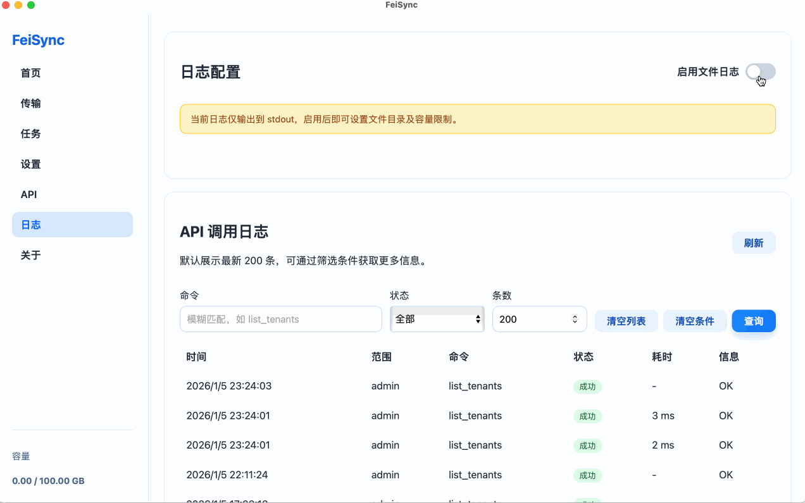
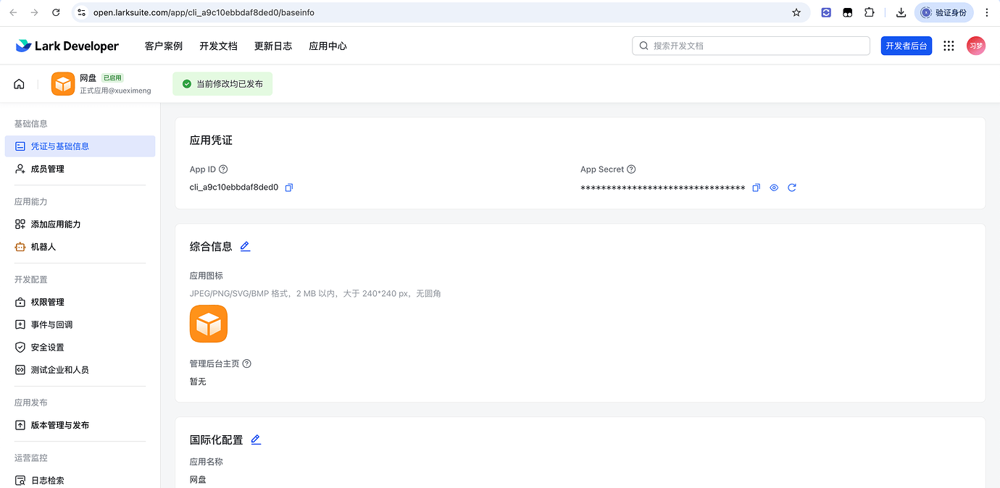
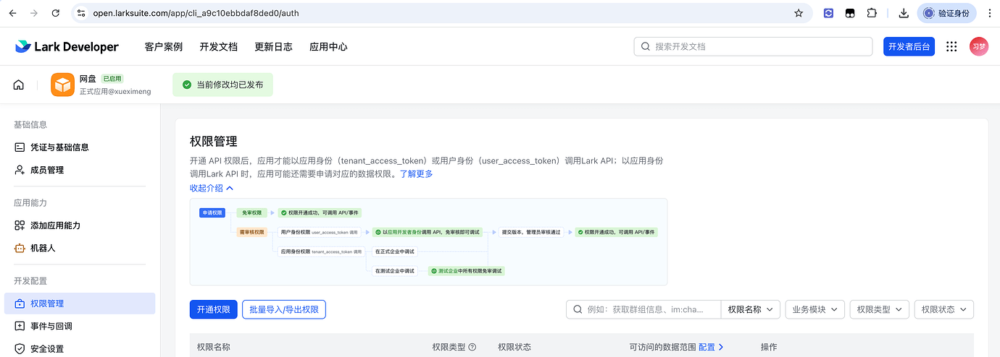

# FeiSync

FeiSync是使用Tauri框架rust+vue3开发，基于Lark / 飞书的网盘客户端，支持文件浏览、搜索、上传/下载和断点续传、拖拽操作、单/双向同步任务、支持多企业实例，读写权限控制，企业分组自动路由可用实例，开放API，日志查看，免费无限扩容，每个账号免费扩容100G，单文件250M

## 主要特性
  - 多企业实例，企业分组功能：支持配置多个 app_id/app_secret，支持分组、读写权限控制、拖拽排序。自动根据排序和读写权限路由可用实例
  - 云盘浏览：首页提供列表/图标模式、排序、面包屑导航、全局搜索、批量操作、拖拽上传/移动
  - 传输中心：展示上传/下载队列，支持暂停、恢复、取消、失败重试以及断点续传，速度/剩余时间实时刷新
  - 支持单向/双向同步的基于cron的定时任务
  - 开放API供第三方调用，可以查看API调用日志
  - 任意扩容，只要添加`App ID`和`App Secret`就可以免费获得100G空间网盘，单文件250M，简单说就是容量上限取决于你的号数量。(不能是同一个企业的不同应用，会共享100G)

## 截图





## 目录结构
```
feisync/
├── package.json          # 前端依赖配置
├── src/                  # Vue3 + Pinia 前端代码
├── src-tauri/            # Rust 后端 + Tauri 配置
├── feisync.tenants.json  # 本地存储的企业实例列表（运行后生成/更新）
└── README.md
```

## 初始化/运行
```bash
cd feisync
npm install
npm run tauri:dev
```

---


# 飞书/Lark创建企业应用教程

https://open.larksuite.com/app

开发者后台创建应用，获取`App ID`和`App Secret`



需要导入权限，点击权限管理-批量导入




```
{
  "scopes": {
    "tenant": [
      "admin:app.admin:check",
      "admin:app.admin:readonly",
      "admin:app.admin_id:readonly",
      "admin:app.enable:write",
      "admin:app.info:readonly",
      "admin:app.user_usable:readonly",
      "admin:app.visibility",
      "application:application.app_usage_stats.overview:readonly",
      "application:application.contacts_range:write",
      "application:application:self_manage",
      "application:bot.menu:write",
      "bitable:app",
      "bitable:app:readonly",
      "board:whiteboard:node:create",
      "board:whiteboard:node:delete",
      "board:whiteboard:node:read",
      "board:whiteboard:node:update",
      "contact:contact",
      "contact:contact.base:readonly",
      "contact:contact:update_department_id",
      "contact:contact:update_user_id",
      "contact:department.base:readonly",
      "contact:department.organize:readonly",
      "contact:functional_role",
      "contact:functional_role:readonly",
      "contact:group",
      "contact:group:readonly",
      "contact:job_title:readonly",
      "contact:role:readonly",
      "contact:user.assign_info:read",
      "contact:user.base:readonly",
      "contact:user.department:readonly",
      "contact:user.dotted_line_leader_info.read",
      "contact:user.email:readonly",
      "contact:user.employee:readonly",
      "contact:user.employee_id:readonly",
      "contact:user.gender:readonly",
      "contact:user.id:readonly",
      "contact:user.phone:readonly",
      "contact:user.subscription_ids:write",
      "contact:user.user_geo",
      "docs:doc",
      "docs:doc:readonly",
      "docs:document.comment:create",
      "docs:document.comment:read",
      "docs:document.comment:write_only",
      "docs:document.content:read",
      "docs:document.media:download",
      "docs:document.media:upload",
      "docs:document.subscription",
      "docs:document.subscription:read",
      "docs:document:copy",
      "docs:document:export",
      "docs:document:import",
      "docs:permission.member",
      "docs:permission.member:auth",
      "docs:permission.member:create",
      "docs:permission.member:delete",
      "docs:permission.member:readonly",
      "docs:permission.member:retrieve",
      "docs:permission.member:transfer",
      "docs:permission.member:update",
      "docs:permission.setting",
      "docs:permission.setting:read",
      "docs:permission.setting:readonly",
      "docs:permission.setting:write_only",
      "docx:document",
      "docx:document.block:convert",
      "docx:document:create",
      "docx:document:readonly",
      "docx:document:write_only",
      "drive:drive",
      "drive:drive.metadata:readonly",
      "drive:drive.search:readonly",
      "drive:drive:readonly",
      "drive:drive:version",
      "drive:drive:version:readonly",
      "drive:export:readonly",
      "drive:file",
      "drive:file.meta.sec_label.read_only",
      "drive:file:download",
      "drive:file:readonly",
      "drive:file:view_record:readonly",
      "sheets:spreadsheet",
      "sheets:spreadsheet:readonly",
      "slides:presentation:create",
      "slides:presentation:read",
      "slides:presentation:update",
      "slides:presentation:write_only",
      "space:document.event:read",
      "space:document:delete",
      "space:document:move",
      "space:document:retrieve",
      "space:document:shortcut",
      "space:folder:create",
      "tenant:tenant.product_assign_info:read",
      "wiki:member:create",
      "wiki:member:retrieve",
      "wiki:member:update",
      "wiki:node:copy",
      "wiki:node:create",
      "wiki:node:move",
      "wiki:node:read",
      "wiki:node:retrieve",
      "wiki:node:update",
      "wiki:setting:read",
      "wiki:setting:write_only",
      "wiki:space:read",
      "wiki:space:retrieve",
      "wiki:space:write_only",
      "wiki:wiki",
      "wiki:wiki:readonly"
    ],
    "user": [
      "contact:user.employee_id:readonly",
      "drive:drive",
      "drive:drive.metadata:readonly",
      "drive:drive:readonly",
      "space:document:retrieve"
    ]
  }
}
```

查看空间容量  

https://larksuite.com/admin/drive/quota/usage